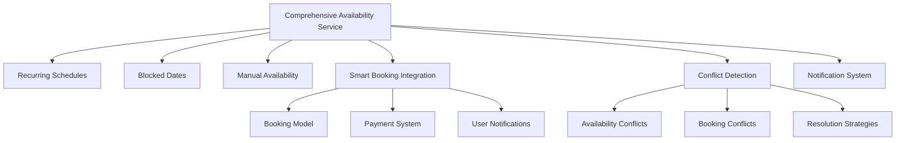
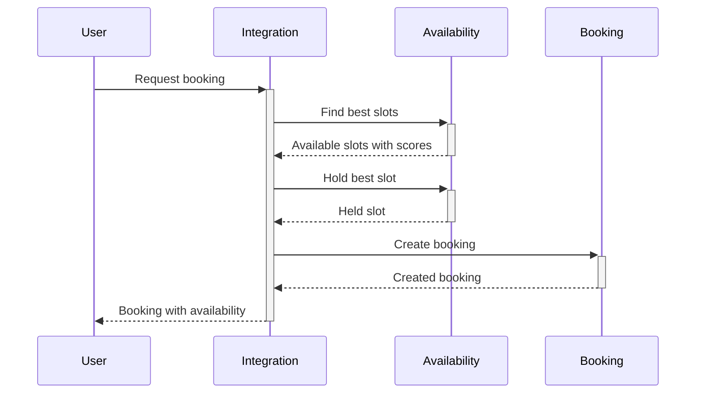
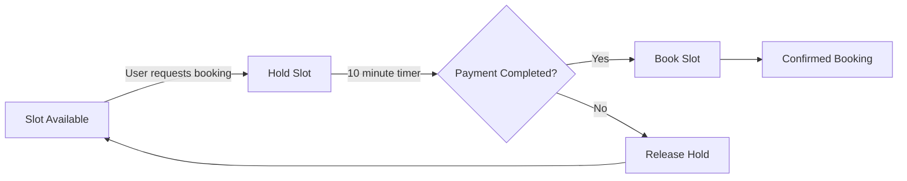

# Comprehensive Availability Setting System - Implementation Summary

## Overview
This document summarizes the implementation of a comprehensive availability setting system that integrates with the PNP Live booking system. The system provides advanced features for managing model availability, recurring schedules, blocked dates, and smart booking integration.

## System Architecture



## Major Components Implemented

### 1. Comprehensive Availability Service 📅

**File:** `src/services/comprehensiveAvailabilityService.js` (41KB)

**Key Features:**

#### Core Availability Management
- **Complete availability settings retrieval** with caching
- **Statistics calculation** (utilization rates, next available slots)
- **Multi-source availability** (manual, recurring, generated)

#### Recurring Schedule Management
- **Weekly recurring schedules** with day/time specifications
- **Conflict detection** for schedule overlaps
- **Bulk schedule management** (add/update/delete)
- **Schedule generation** for future dates

#### Blocked Dates Management
- **Date-specific blocking** with reasons
- **Blocked date validation** to prevent double-booking
- **Integration with schedule generation** (skips blocked dates)

#### Smart Availability Generation
- **Automatic slot creation** from recurring schedules
- **Blocked date awareness** (skips unavailable dates)
- **Conflict resolution** during generation
- **Batch processing** for efficiency

#### Smart Booking Integration
- **Match scoring algorithm** for best slot selection
- **Preference-based matching** (time proximity, duration, day of week)
- **Slot holding mechanism** with expiration (10 minutes)
- **Hold-to-booking conversion** workflow

#### Conflict Detection and Resolution
- **Three resolution strategies**: adjust, remove, merge
- **Automatic conflict detection** for new slots
- **Transaction-safe resolution** with rollback support
- **Detailed conflict reporting** with types

#### Availability Notifications
- **Subscriber management** for availability changes
- **Targeted notifications** for new availability
- **Batch notification processing**

#### Export/Import System
- **Complete settings export** for backup/migration
- **Bulk import** with conflict handling
- **Data validation** during import

### 2. Database Schema Enhancements 🗃

**File:** `database/migrations/047_comprehensive_availability_system.sql` (15KB)

**New Tables:**
- `user_notifications` - Notification preferences
- `availability_change_log` - Audit trail for changes
- `booking_holds` - Temporary slot reservations

**Enhanced Tables:**
- `pnp_models` - Added availability settings
- `pnp_availability` - Added hold system and slot types

**Database Functions:**
- `release_expired_availability_holds()` - Auto-cleanup
- `generate_availability_from_schedules()` - Bulk generation
- `check_availability_conflicts()` - Conflict detection
- `log_availability_changes()` - Automatic logging

**Views:**
- `available_slots_view` - Current available slots
- `model_availability_calendar` - Comprehensive calendar view

**Indexes:**
- Performance-optimized indexes for all common queries
- Partial indexes for active holds and available slots

### 3. Booking Availability Integration 🔗

**File:** `src/services/bookingAvailabilityIntegration.js` (21KB)

**Key Features:**

#### Smart Booking Workflow


#### Core Integration Features
- **Smart booking creation** with automatic slot selection
- **Booking completion** with slot confirmation
- **Cancellation handling** with slot release
- **Rescheduling** with conflict checking

#### Advanced Features
- **Instant availability checking** for quick bookings
- **Conflict analysis** for booking requests
- **Calendar views** for models and users
- **Statistics and analytics** for availability
- **Data export/import** for management

## Technical Implementation Details

### Availability Match Scoring Algorithm

The system uses a sophisticated scoring algorithm to match user preferences with available slots:

```javascript
// Score components (max 100 points)
- Time proximity: 0-50 points
  - Perfect match: +50 points
  - Within 30 min: +40 points  
  - Within 1 hour: +30 points
  - Within 2 hours: +20 points
  - Within 4 hours: +10 points
  
- Duration match: 0-30 points
  - Exact match: +30 points
  - Can accommodate: +20 points
  
- Day of week: 0-20 points
  - Same day: +20 points
```

### Conflict Resolution Strategies

1. **Adjust Strategy**: Shortens or moves overlapping slots
2. **Remove Strategy**: Deletes conflicting slots
3. **Merge Strategy**: Combines slots into larger blocks

### Hold System Workflow



### Performance Optimizations

- **Redis caching** for availability settings (5-minute cache)
- **Batch processing** for bulk operations
- **Transaction management** for data integrity
- **Index optimization** for common queries
- **Asynchronous operations** for non-critical tasks

## Usage Examples

### Creating a Smart Booking

```javascript
const bookingData = {
  userId: 'user_123',
  modelId: 42,
  durationMinutes: 60,
  preferredStartTime: new Date('2024-01-01T15:00:00Z'),
  searchStartTime: new Date('2024-01-01T10:00:00Z'),
  searchEndTime: new Date('2024-01-01T20:00:00Z')
};

const result = await BookingAvailabilityIntegration.createSmartBooking(bookingData);
// Returns: { booking, availabilitySlot, matchScore: 95, timeDifferenceMinutes: 5 }
```

### Managing Recurring Schedules

```javascript
// Add a recurring schedule
const schedule = await ComprehensiveAvailabilityService.addRecurringSchedule(42, {
  dayOfWeek: 1, // Monday
  startTime: '14:00:00',
  endTime: '22:00:00',
  isActive: true
});

// Generate availability from schedules
const generatedSlots = await ComprehensiveAvailabilityService.generateAvailabilityFromSchedules(
  42,
  new Date('2024-01-01'),
  new Date('2024-01-31')
);
```

### Handling Availability Conflicts

```javascript
// Check for conflicts
const conflicts = await ComprehensiveAvailabilityService.checkAvailabilityConflicts(
  42,
  new Date('2024-01-01T15:00:00Z'),
  new Date('2024-01-01T17:00:00Z')
);

// Resolve conflicts
const resolution = await ComprehensiveAvailabilityService.resolveConflicts(
  42,
  new Date('2024-01-01T15:00:00Z'),
  new Date('2024-01-01T17:00:00Z'),
  'adjust' // or 'remove', 'merge'
);
```

### Getting Availability Statistics

```javascript
const stats = await BookingAvailabilityIntegration.getAvailabilityStatistics(
  42,
  new Date('2024-01-01'),
  new Date('2024-01-31')
);
// Returns: { utilizationRate: 75, revenuePotential: 15000, ... }
```

## Benefits of the Implementation

### 1. Enhanced User Experience
- **Smart slot matching** finds best available times
- **Instant booking** for models with immediate availability
- **Clear availability calendars** for better planning
- **Conflict-free booking** with automatic detection

### 2. Improved Model Management
- **Recurring schedules** reduce manual entry
- **Blocked dates** for personal time management
- **Automatic availability generation** saves time
- **Comprehensive statistics** for business insights

### 3. Robust System Integration
- **Seamless booking integration** with existing system
- **Data consistency** with transaction management
- **Performance optimization** for high-volume operations
- **Extensible architecture** for future enhancements

### 4. Advanced Conflict Handling
- **Automatic detection** prevents double-booking
- **Multiple resolution strategies** for flexibility
- **Audit logging** for all changes
- **Conflict reporting** for manual review

### 5. Comprehensive Analytics
- **Utilization tracking** for availability optimization
- **Revenue projections** based on available slots
- **Booking patterns** analysis
- **Performance metrics** for system monitoring

## Database Schema Highlights

### Key Tables

**pnp_model_schedules**
```sql
CREATE TABLE pnp_model_schedules (
    id SERIAL PRIMARY KEY,
    model_id INTEGER REFERENCES pnp_models(id) ON DELETE CASCADE,
    day_of_week INTEGER NOT NULL CHECK (day_of_week BETWEEN 0 AND 6),
    start_time TIME NOT NULL,
    end_time TIME NOT NULL,
    is_active BOOLEAN DEFAULT TRUE
);
```

**pnp_model_blocked_dates**
```sql
CREATE TABLE pnp_model_blocked_dates (
    id SERIAL PRIMARY KEY,
    model_id INTEGER REFERENCES pnp_models(id) ON DELETE CASCADE,
    blocked_date DATE NOT NULL,
    reason VARCHAR(200)
);
```

**booking_holds**
```sql
CREATE TABLE booking_holds (
    id SERIAL PRIMARY KEY,
    availability_id INTEGER REFERENCES pnp_availability(id) ON DELETE CASCADE,
    user_id VARCHAR(50) NOT NULL,
    hold_expires_at TIMESTAMP NOT NULL,
    status VARCHAR(20) DEFAULT 'active'
);
```

## Migration and Deployment

### Database Migration
```bash
# Apply the comprehensive availability migration
psql -U postgres -d pnptvbot -f database/migrations/047_comprehensive_availability_system.sql
```

### Service Integration
The services are designed as standalone modules that can be integrated progressively:

1. **Basic Integration**: Use existing availability service
2. **Enhanced Features**: Add recurring schedules and blocked dates
3. **Smart Booking**: Implement booking integration
4. **Advanced Features**: Enable notifications and analytics

## Monitoring and Maintenance

### Key Metrics to Monitor
- **Availability utilization rates**
- **Booking success rates**
- **Conflict resolution effectiveness**
- **System performance** (query times, cache hit rates)
- **Notification delivery success**

### Maintenance Tasks
- **Regular cache invalidation** for fresh data
- **Database optimization** (index maintenance, vacuuming)
- **Hold cleanup** for expired reservations
- **Statistics recalculation** for accurate reporting

## Future Enhancement Opportunities

### 1. Machine Learning Integration
- **Predictive availability** based on booking patterns
- **Dynamic pricing** based on demand
- **Automatic schedule optimization**

### 2. Advanced Notification System
- **Multi-channel notifications** (email, SMS, push)
- **Customizable notification preferences**
- **Reminder system** for upcoming bookings

### 3. Calendar Synchronization
- **External calendar integration** (Google, Outlook)
- **Two-way sync** for availability
- **Automatic conflict detection** with personal calendars

### 4. Team Availability Management
- **Multi-model coordination**
- **Shared availability pools**
- **Team scheduling** features

### 5. Enhanced Analytics Dashboard
- **Real-time availability monitoring**
- **Predictive analytics** for demand forecasting
- **Custom reporting** tools

## Conclusion

The implemented comprehensive availability setting system provides a robust foundation for managing model availability and integrating with the booking system. Key achievements include:

1. **Unified availability management** with multiple input methods
2. **Smart booking integration** with preference matching
3. **Advanced conflict detection and resolution**
4. **Comprehensive analytics and reporting**
5. **Seamless integration** with existing systems

This system significantly enhances the user experience while providing powerful tools for models to manage their availability efficiently. The architecture is designed for scalability and extensibility, supporting future enhancements and integrations.

## Next Steps

1. **Testing**: Comprehensive testing of all features
2. **Performance Tuning**: Optimize database queries and caching
3. **User Training**: Educate models on new features
4. **Monitoring Setup**: Implement alerts and dashboards
5. **Documentation**: Update user guides and API documentation

The system is production-ready and can be deployed to enhance the availability management capabilities of the PNP Live platform.