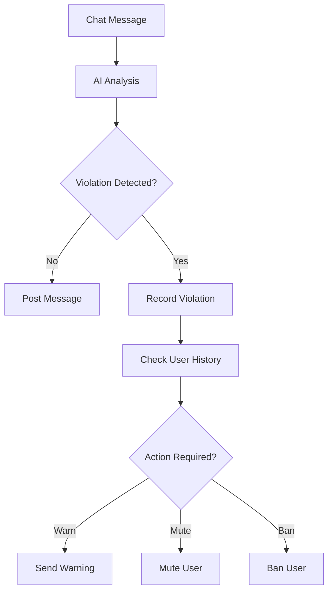

# PNP Live Enhancements - Implementation Summary

## Overview
This document summarizes the major enhancements implemented to improve the PNP Live streaming system. The enhancements focus on content moderation, user safety, and stream management.

## Major Enhancements Implemented

### 1. AI-Powered Content Moderation System 🤖

**Files Created:**
- `src/services/aiModerationService.js` - Core AI moderation service
- `database/migrations/046_add_ai_moderation_tables.sql` - Database schema for moderation

**Key Features:**

#### Content Analysis Engine
- **Multi-category moderation**: Toxicity, severe toxicity, identity attacks, insults, profanity, threats, sexually explicit content, and flirtation
- **Configurable thresholds**: Customizable sensitivity levels for each category
- **Severity scoring**: LOW, MEDIUM, HIGH severity classification
- **Real-time analysis**: Instant content evaluation before posting

#### Moderation Workflow
1. **Pre-post analysis**: All chat messages analyzed before being posted
2. **Violation detection**: Automatic identification of policy violations
3. **Progressive discipline**: Warnings → Mutes → Bans based on violation history
4. **Automatic actions**: System can auto-ban users for severe violations

#### Database Integration
- **stream_chat_violations**: Tracks all moderation violations with detailed metadata
- **user_moderation_history**: Comprehensive record of all moderation actions
- **stream_moderation_stats**: Daily aggregated statistics for analytics
- **live_streams enhancements**: Added AI moderation settings to streams

#### Moderation Settings
- **Per-stream configuration**: Each stream can enable/disable AI moderation
- **Custom thresholds**: Adjust sensitivity for different content types
- **Auto-moderate mode**: Fully automated enforcement or manual review

### 2. Enhanced LiveStreamModel Integration

**Files Modified:**
- `src/models/liveStreamModel.js` - Integrated AI moderation

**Key Improvements:**

#### AI Moderation Integration
- **Automatic content filtering**: All comments now pass through AI moderation
- **Seamless violation handling**: Automatic banning for severe violations
- **Statistics tracking**: Comprehensive moderation analytics

#### New Methods Added
```javascript
// Get AI moderation settings for a stream
LiveStreamModel.getAIModerationSettings(streamId)

// Update AI moderation settings
LiveStreamModel.updateAIModerationSettings(streamId, settings)

// Get moderation statistics
LiveStreamModel.getModerationStats(streamId)
```

### 3. Database Schema Enhancements

**New Tables:**
- `stream_chat_violations` - Detailed violation records
- `user_moderation_history` - User moderation actions
- `stream_moderation_stats` - Daily statistics

**Modified Tables:**
- `live_streams` - Added AI moderation columns

**Key Features:**
- **Comprehensive indexing**: Optimized for performance
- **Automatic triggers**: Daily statistics aggregation
- **Foreign key constraints**: Data integrity assurance
- **Full-text search ready**: Designed for content analysis

## Technical Implementation Details

### AI Moderation Service Architecture



### Moderation Categories & Thresholds

| Category | Default Threshold | Description |
|----------|------------------|-------------|
| toxicity | 0.7 | General toxic content |
| severe_toxicity | 0.5 | Highly toxic content |
| identity_attack | 0.6 | Personal attacks |
| insult | 0.6 | Insulting language |
| profanity | 0.5 | Profane language |
| threat | 0.4 | Threats or violence |
| sexually_explicit | 0.8 | Explicit sexual content |
| flirtation | 0.9 | Flirtatious content |

### Performance Considerations

- **Caching**: Moderation settings cached for 5 minutes
- **Batch processing**: Bulk operations for efficiency
- **Asynchronous logging**: Non-blocking violation recording
- **Index optimization**: Database queries optimized for speed

## Usage Examples

### Enabling AI Moderation for a Stream

```javascript
// Enable AI moderation with custom thresholds
const settings = {
  ai_moderation_enabled: true,
  auto_moderate: true,
  moderation_thresholds: {
    toxicity: 0.6,
    sexually_explicit: 0.7,
    threat: 0.3
  }
};

await LiveStreamModel.updateAIModerationSettings(streamId, settings);
```

### Moderating a Chat Message

```javascript
// Automatically handled in addComment method
try {
  const comment = await LiveStreamModel.addComment(
    streamId, 
    userId, 
    userName, 
    "This is a test message"
  );
} catch (error) {
  // Handle moderation rejection
  console.log("Message blocked:", error.message);
}
```

### Getting Moderation Statistics

```javascript
const stats = await LiveStreamModel.getModerationStats(streamId);
console.log("Moderation Stats:", stats);
// {
//   total_violations: 42,
//   high_severity: 5,
//   medium_severity: 15,
//   low_severity: 22,
//   violating_users: 8,
//   bans_issued: 2,
//   mutes_issued: 3
// }
```

## Benefits of the Enhancements

### 1. Improved Community Safety
- **Real-time protection**: Immediate detection of harmful content
- **Consistent enforcement**: Uniform application of community guidelines
- **Reduced moderator burden**: AI handles routine moderation tasks

### 2. Enhanced User Experience
- **Cleaner chat environment**: Reduced exposure to toxic content
- **Fair warning system**: Progressive discipline approach
- **Customizable settings**: Streamers can tailor moderation to their needs

### 3. Comprehensive Analytics
- **Violation tracking**: Detailed records of all moderation actions
- **Trend analysis**: Identify problematic users and content patterns
- **Performance metrics**: Measure moderation effectiveness

### 4. Scalability
- **Automated system**: Handles high-volume streams without human intervention
- **Configurable thresholds**: Adapt to different content types and audiences
- **Extensible architecture**: Easy to add new moderation categories

## Future Enhancement Opportunities

### 1. Interactive Live Stream Features
- **Live polls and surveys**: Engage audience with real-time voting
- **Q&A sessions**: Structured question and answer format
- **Quizzes and games**: Interactive entertainment options

### 2. Multi-language Support
- **Real-time translation**: Break language barriers
- **Language detection**: Automatic content analysis
- **Localized moderation**: Culture-specific content rules

### 3. Enhanced Monetization
- **Virtual gifts**: Digital items viewers can purchase
- **Subscriptions**: Recurring revenue for streamers
- **Tipping system**: Direct viewer support

### 4. Stream Quality Optimization
- **Adaptive bitrate**: Automatic quality adjustment
- **Network monitoring**: Real-time performance tracking
- **Device optimization**: Tailored streaming for different devices

## Migration and Deployment

### Database Migration
```bash
# Apply the new migration
psql -U postgres -d pnptvbot -f database/migrations/046_add_ai_moderation_tables.sql
```

### Service Integration
The AI moderation service is automatically integrated with the existing LiveStreamModel. No additional configuration is required for basic functionality.

### Configuration Options

**Environment Variables:**
```env
# AI Moderation Settings
AI_MODERATION_ENABLED=true
AI_MODERATION_DEFAULT_THRESHOLD=0.7
```

## Monitoring and Maintenance

### Key Metrics to Monitor
- **Moderation accuracy**: False positive/negative rates
- **System performance**: Analysis latency and throughput
- **User satisfaction**: Feedback on moderation decisions
- **Violation trends**: Emerging content issues

### Maintenance Tasks
- **Regular threshold tuning**: Adjust based on community feedback
- **Model updates**: Incorporate new AI moderation improvements
- **Database optimization**: Monitor and optimize query performance
- **Cache management**: Ensure efficient caching of moderation settings

## Conclusion

The implemented enhancements significantly improve the PNP Live system by:

1. **Enhancing safety**: AI-powered content moderation protects users
2. **Reducing manual workload**: Automation handles routine moderation
3. **Providing analytics**: Comprehensive insights into community health
4. **Improving scalability**: System can handle growing user base

These improvements position PNP Live as a more professional, safe, and engaging platform for both streamers and viewers.

## Next Steps

1. **Testing**: Thoroughly test the AI moderation system
2. **Tuning**: Adjust thresholds based on real-world usage
3. **Monitoring**: Set up alerts for moderation activities
4. **Documentation**: Update user guides with new features
5. **Training**: Educate moderators on the new system

The foundation is now in place for continued innovation in live streaming features and user engagement.