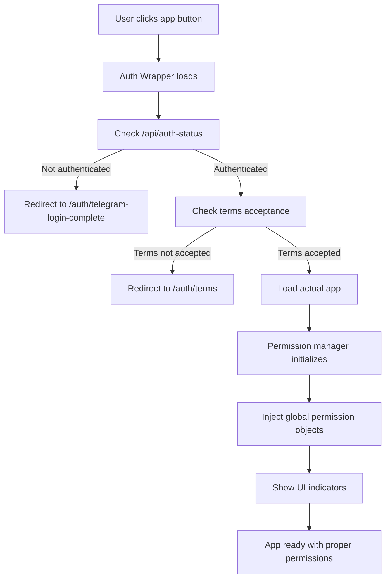

# PNPtv Permission System

## Overview

The PNPtv Permission System enforces access control for Hangouts and Videorama applications based on user subscription levels (FREE vs PRIME).

## Architecture

```
User → Auth Wrapper → Permission Check → App Access
  ├─ FREE User → Limited Permissions
  └─ PRIME User → Full Permissions
```

## Components

### 1. Authentication Layer
- **Telegram Login Widget**: Official Telegram authentication
- **Session Management**: `express-session` with secure cookies
- **API Endpoints**: `/api/telegram-auth`, `/api/auth-status`, `/api/logout`

### 2. Permission Layer
- **Hangouts Permission Manager**: `public/hangouts/permission-check.js`
- **Videorama Permission Manager**: `public/videorama-app/permission-check.js`
- **Global Objects**: `window.HANGOUTS_PERMISSIONS`, `window.VIDEORAMA_PERMISSIONS`

### 3. UI Layer
- **Subscription Badges**: Shows user status (FREE/PRIME)
- **Upgrade Prompts**: Modal dialogs with feature comparisons
- **Error Handling**: User-friendly error messages

## Permission Matrix

### Hangouts

| Permission | FREE/Churned | PRIME |
|------------|--------------|-------|
| `canJoinPublicRooms` | ✅ Yes | ✅ Yes |
| `canJoinPrivateRooms` | ❌ No | ✅ Yes |
| `canCreatePublicRooms` | ❌ No | ✅ Yes |
| `canCreatePrivateRooms` | ❌ No | ✅ Yes |

### Videorama

| Permission | FREE/Churned | PRIME |
|------------|--------------|-------|
| `canPlayPublicContent` | ✅ Yes | ✅ Yes |
| `canPlayPrivateContent` | ❌ No | ✅ Yes |
| `canCreatePublicPlaylists` | ❌ No | ✅ Yes |
| `canCreatePrivatePlaylists` | ❌ No | ✅ Yes |
| `canBroadcast` | ❌ No | ✅ Yes |
| `canUsePremiumFeatures` | ❌ No | ✅ Yes |

## API Reference

### `window.HANGOUTS_PERMISSIONS`

```javascript
{
  user: {
    id: number,
    username: string,
    isPrime: boolean,
    subscriptionStatus: 'free' | 'active' | 'expired' | 'churned'
  },
  permissions: {
    canJoinPublicRooms: boolean,
    canJoinPrivateRooms: boolean,
    canCreatePublicRooms: boolean,
    canCreatePrivateRooms: boolean
  },
  can: (permission: string) => boolean,
  isPrime: () => boolean,
  showUpgradePrompt: () => void
}
```

### `window.VIDEORAMA_PERMISSIONS`

```javascript
{
  user: {
    id: number,
    username: string,
    isPrime: boolean,
    subscriptionStatus: 'free' | 'active' | 'expired' | 'churned'
  },
  permissions: {
    canPlayPublicContent: boolean,
    canPlayPrivateContent: boolean,
    canCreatePublicPlaylists: boolean,
    canCreatePrivatePlaylists: boolean,
    canBroadcast: boolean,
    canUsePremiumFeatures: boolean
  },
  can: (permission: string) => boolean,
  isPrime: () => boolean,
  showUpgradePrompt: () => void,
  getFeatureList: () => string[]
}
```

## Usage Examples

### Checking Permissions

```javascript
// Check if user can create private rooms
if (window.HANGOUTS_PERMISSIONS.can('canCreatePrivateRooms')) {
  // Show create room button
  showCreateRoomButton();
} else {
  // Show upgrade prompt
  window.HANGOUTS_PERMISSIONS.showUpgradePrompt();
}
```

### Static Methods

```javascript
// Check permission before showing UI element
HangoutsPermissionManager.checkPermission('canCreatePublicRooms')
  .then(canCreate => {
    if (canCreate) {
      document.getElementById('create-room-btn').style.display = 'block';
    }
  });
```

### React/Vue Integration

```javascript
// In React component
const canCreatePlaylist = window.VIDEORAMA_PERMISSIONS?.can('canCreatePublicPlaylists');

return (
  <div>
    {canCreatePlaylist ? (
      <button onClick={createPlaylist}>Create Playlist</button>
    ) : (
      <button onClick={() => window.VIDEORAMA_PERMISSIONS.showUpgradePrompt()}>
        Upgrade to Create Playlists
      </button>
    )}
  </div>
);
```

## Implementation Details

### Automatic Initialization

The permission managers initialize automatically when the apps load:

1. **Hangouts**: `public/hangouts/permission-check.js` loads with the app
2. **Videorama**: `public/videorama-app/permission-check.js` loads with the app
3. **Auto-init**: Scripts check for existing initialization to avoid duplicates

### Session Flow



### UI Indicators

- **Subscription Badge**: Fixed position badge showing FREE/PRIME status
- **Upgrade Prompts**: Modal dialogs with feature comparisons
- **Error Messages**: Temporary error notifications

### Error Handling

- Network errors show user-friendly messages
- Authentication failures redirect to login
- Permission errors show upgrade prompts
- All errors are logged to console for debugging

## Security Considerations

1. **Client-side only**: Permission checks are for UI/UX only
2. **Server validation required**: Critical operations should validate permissions server-side
3. **Session security**: Uses secure, HTTP-only cookies
4. **No sensitive data**: Only exposes necessary user information

## Customization

### Styling

Override default styles by adding CSS after the permission script loads:

```css
/* Customize subscription badge */
#subscription-badge {
  background: #your-color !important;
  bottom: 30px !important;
}
```

### Feature Lists

Modify the feature lists in the `_getFeatureList()` methods to match your actual features.

## Troubleshooting

### "Permissions not initialized"
- **Cause**: Script loaded before DOM ready
- **Solution**: Wait for `DOMContentLoaded` event

### "User not authenticated"
- **Cause**: Session expired or invalid
- **Solution**: Redirect to login page

### "Permission check failed"
- **Cause**: Network error or backend issue
- **Solution**: Check console logs and backend status

## Future Enhancements

- Server-side permission validation API
- Role-based access control (RBAC)
- Temporary permission upgrades
- Permission audit logging

## Support

For issues with the permission system:
1. Check browser console logs
2. Verify session cookies
3. Test API endpoints directly
4. Review network requests in dev tools

---

**Last Updated**: January 16, 2026
**Version**: 1.0.0